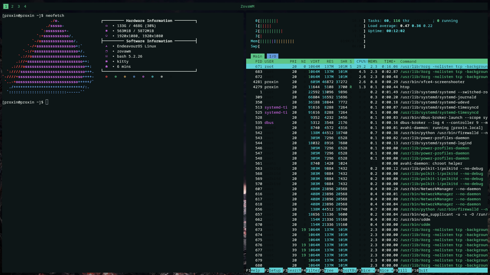

# ZovaWM

ZovaWM is a window manager for x11 written in rust.




## Why use ZovaWM?

The main purpose of ZovaWM is a full-featured minimal window manager,
this makes it a great lightweight option while still having features such as
multi monitor and EWMH support.


## Running from a display manager

Running ZovaWM from a display manager is really easy,
you only need to write the following into `/usr/share/xsessions/zovawm.desktop`.

```
[Desktop Entry]
Name=zovawm
Comment=zova window manager
Exec=zovawm
Type=Application
```


## Running in Xephyr

### Single monitor (Xephyr)

```
$ Xephyr -br -ac -noreset -screen 800x600 :1
$ DISPLAY=:1 cargo run
```


### Multi monitor (Xephyr)

When running in multi monitor Xephyr it is a know problem that the cursor can get a little messed up sometimes,
to my knowledge this has nothing to do with ZovaWM as i have tested in other WM's such as dwm and gotten the same result.

```
$ Xephyr -br -ac -noreset +xinerama -screen 800x600 -screen 800x600 :1
$ DISPLAY=:1 cargo run
```

## Configuring

### Autostart
ZovaWM will by default execute a shell file located at `.config/zovawm/startup.sh`.
This file needs to have permission to execute.

### Creating a config
ZovaWM will look for a config file at `.config/zovawm/config.toml`, as
you may have seen by the file extension this is a toml configuration.

The default configuration is as follows:
```
# Enable default bar, disabling this will allow you to use external bars
default-bar = true

# Padding of tiled windows
top-padding     = 50
bottom-padding  = 10
left-padding    = 10
right-padding   = 10

# WM specific keybindings
keybindings = [
    # Programs
    { key = "Return",   exec = "kitty" },
    { key = "d",        exec = "rmenu" },

    # Internal
    { key = "q",        internal = "kill" },
    { key = "m",        internal = "restart" },
    { key = "Up",       internal = "window_up" },
    { key = "Down",     internal = "window_down" },
    { key = "Left",     internal = "window_master" },
]
```

#### Default bar
The default bar can be disabled by setting `default-bar` to `false`.

#### Padding
The padding between the monitor and the area in which windows are tiled can be modified
with `{direction}-padding` where `{direction}` can be any of the following `top`, `bottom`, `left`, `right`.


